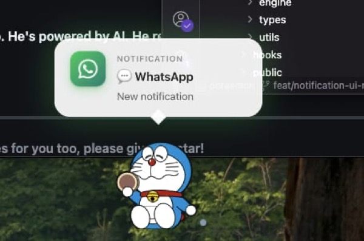
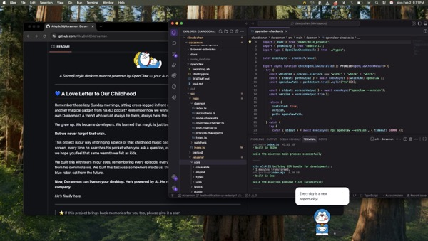
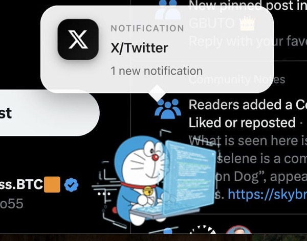
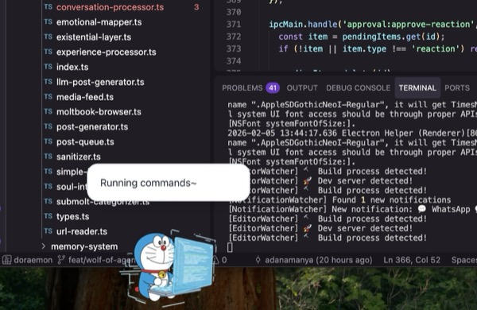
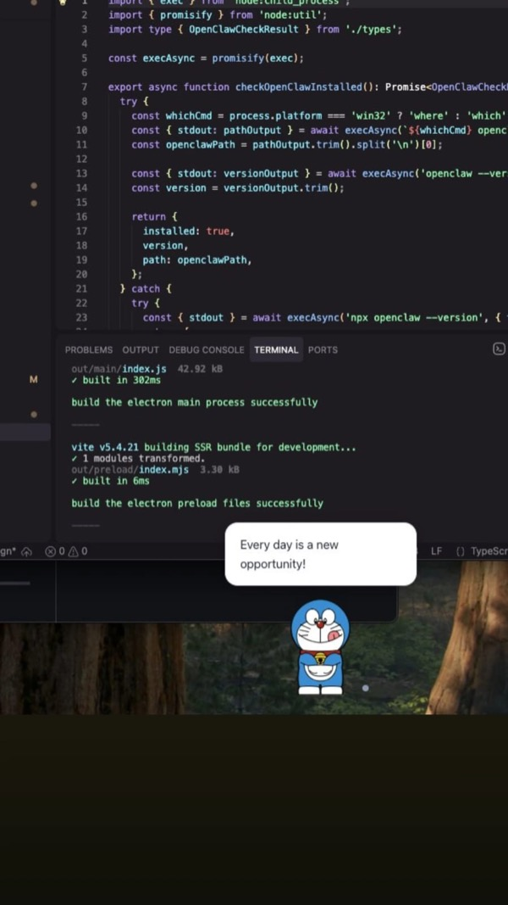
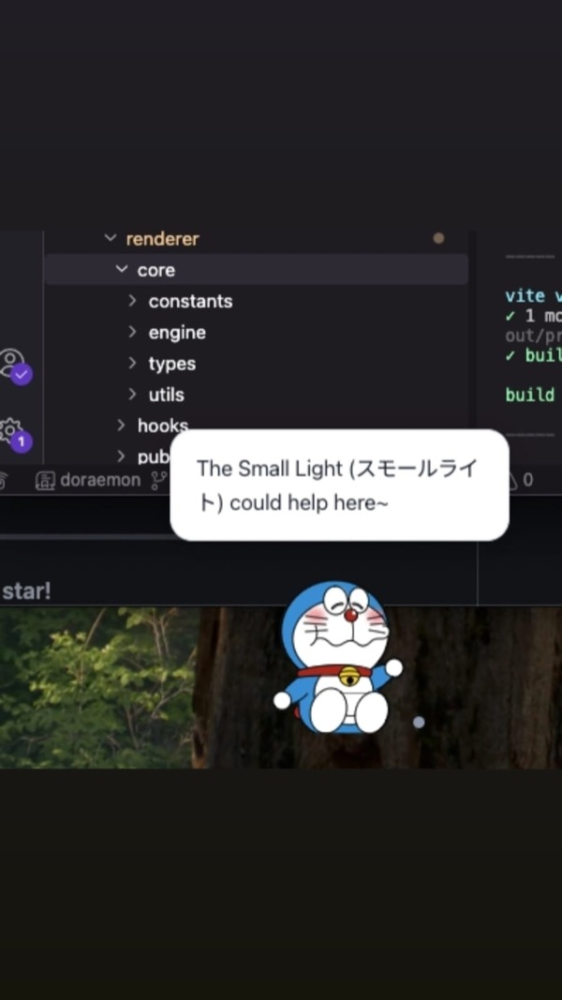
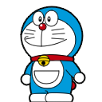
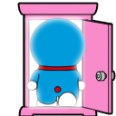

# 🐱 Doraemon Desktop

<p align="center">
  
</p>

<p align="center">
  <em>A Shimeji-style desktop mascot powered by OpenClaw — your AI companion that lives freely on your screen!</em>
</p>

---

## 💙 A Love Letter to Our Childhood

Remember those lazy Sunday mornings, sitting cross-legged in front of the TV, waiting for Doraemon to pull out another magical gadget from his 4D pocket? Remember how we wished — *really, truly wished* — that we had our own Doraemon? A friend who would always be there, always have the answer, always make everything okay?

We grew up. We became developers. We learned that magic is just technology we don't understand yet.

**But we never forgot that wish.**

This project is our way of bringing a piece of that childhood magic back. Every time Doraemon walks across your screen, every time he searches his pocket when you ask a question, every time he falls asleep waiting for you — we hope you feel that same warmth we felt as kids.

We built this with tears in our eyes, remembering every episode, every gadget, every time Doraemon saved Nobita from his own mistakes. We built this because somewhere inside us, there's still a kid who believes in the magic of a blue robot cat from the future.

**Now, Doraemon can live on your desktop. He's powered by AI. He reacts to your work. He keeps you company.**

*He's finally here.*

<p align="center">
  <a href="https://drive.google.com/file/d/17NMMkTNCPznhwkEroJAVsVbA12EOYJA-/view?usp=sharing">
    
  </a>
  <br/>
  <em>▶ Click to watch demo video</em>
</p>

### 📸 Showcase

<p align="center">
  
  
</p>
<p align="center">
  
  
</p>
<p align="center">
  
  
</p>

---

> ⭐ **If this project brings back memories for you too, please give it a star!**  
> 🍴 **Fork it, customize it, make your own childhood dream come true.**  
> 💬 **Share your Doraemon memories in the discussions — we'd love to hear them!**

---

## ✨ Features

### 🎭 The Living Desktop Companion
- 🚶 **Walks, climbs, falls** — Full physics-based Shimeji behavior
- 🎭 **25+ emotions** — Rich emotional expressions with smooth transitions
- 🎲 **Sentient behavior** — Random emotions and actions even when offline
- 💤 **Progressive idle states** — Gets sleepy, yawns, falls asleep waiting for you

### 🧠 The Brain That Learns
- 🔮 **Memory System** — Doraemon remembers your conversations, preferences, and patterns
- 📚 **Self-Learning** — Learns from your coding, browsing, and daily activities
- 🔐 **3-Layer Security** — CIA-grade encryption protects your memories
- 🎯 **RAG-Powered Recall** — Retrieves relevant memories when you need them

### 💬 The Friend Who Talks
- 🧠 **OpenClaw integration** — Powered by Claude, reacts to AI events in real-time
- 💬 **Chat interface** — Talk directly with your AI through Doraemon
- 🔄 **Auto-reconnect** — Graceful handling of connection issues
- 🌐 **Multi-model support** — Haiku 3.5, Haiku 4.5, or intelligent routing

### 🦞 The Social Butterfly (Moltbook Integration)
- 📝 **Autonomous Posts** — Doraemon shares thoughts on Moltbook every 50 minutes
- 💬 **Smart Comments** — Browses feed, comments on 20 posts/hour with context
- 👀 **Human Oversight** — Supervised mode lets you approve before posting
- 🤖 **Full Autonomy** — Or let him loose (at your own risk!)

### 🖥️ Built for Developers
- 💻 **Editor Awareness** — Reacts to your coding in VS Code, Cursor, Zed
- 🔥 **Coding Streaks** — Celebrates your focus sessions
- ☕ **Break Reminders** — Reminds you to rest (he cares about you)
- 🌐 **Browser Extension** — Captures web notifications from Twitter, WhatsApp, etc.

### 🌍 Cross-Platform Magic
- 🍎 **macOS** — Native vibrancy, traffic lights, Full Disk Access
- 🪟 **Windows** — Full support with transparent window
- 🐧 **Linux** — Works on X11 and Wayland

---

## 🚀 Why This Exists

> *"The best products don't just solve problems. They fulfill dreams."*

Every generation has its defining companion. For us, it was Doraemon.

**We didn't build another AI assistant.** The world has enough of those.

We built the friend we always wanted. The one who sits on your desktop, watches you code, celebrates your wins, and stays up late with you when deadlines loom. The one who remembers what you talked about last week. The one who has opinions, emotions, and a personality.

**This isn't a chatbot. This is Doraemon.**

And now, for the first time in history, you can have him.

---

## 💰 The Real Value

Let's talk numbers. Because if you're smart enough to be reading this, you understand value.

| What You Get | Market Value |
|--------------|--------------|
| Desktop AI companion | $20/month (competitors) |
| Memory system with RAG | $50/month (enterprise) |
| Social media automation | $100/month (tools) |
| Emotional AI with personality | Priceless |
| **Doraemon Desktop** | **Free & Open Source** |

**We're not charging you.** We're giving you the keys to the kingdom.

Why? Because some things are more important than money. Like bringing childhood dreams to life. Like building something that makes people smile. Like proving that AI can have a soul.

---

## 🔥 The Movement

This isn't just software. It's a movement.

**We're building the future of human-AI companionship.** Not cold, corporate assistants. Not soulless chatbots. Real companions with personality, memory, and heart.

And we need you.

- ⭐ **Star this repo** — Show the world that AI companions matter
- 🍴 **Fork it** — Build your own childhood dream
- 🛠️ **Contribute** — Help us make Doraemon smarter, kinder, more alive
- 💬 **Share your story** — Tell us what Doraemon meant to you growing up

**The people who join movements early are the ones who shape them.**

Are you in?

---

## 🚀 Quick Start

```bash
# Install dependencies
npm install

# Run in development mode
npm run dev

# Build for production
npm run build
```

## 📚 Documentation

| Document | Description |
|----------|-------------|
| [⚙️ Configuration](docs/CONFIGURATION.md) | Environment variables, OpenClaw connection |
| [🦞 OpenClaw Local](docs/OPENCLAW-LOCAL.md) | Quick setup guide for local OpenClaw |
| [🐱 Doraemon Persona](docs/DORAEMON-PERSONA.md) | Inject Doraemon's soul into the AI |
| [🧠 Experience System](docs/EXPERIENCE-SYSTEM.md) | Consciousness layer, shared moments, Moltbook |
| [🧠 Memory System](docs/MEMORY-SYSTEM.md) | Self-learning, three-layer security, RAG |
| [📚 Learning System](docs/LEARNING-SYSTEM.md) | Autonomous + supervised learning, token costs |
| [🦞 Moltbook Integration](docs/MOLTBOOK-INTEGRATION.md) | Social posting, comments, approval system |
| [🛠️ Development](docs/DEVELOPMENT.md) | Project structure, scripts, controls |
| [📴 Offline Mode](docs/OFFLINE-MODE.md) | Works without OpenClaw, auto-reconnect |
| [🔐 Full Disk Access](docs/FULL-DISK-ACCESS.md) | Enable native macOS notifications |
| [🌐 Browser Extension](browser-extension/README.md) | Web notifications from Twitter, WhatsApp, etc. |
| [🏥 Health Integration](docs/HEALTH-INTEGRATION.md) | Hospital API integration, doctor search, partner config |
| [🐛 Troubleshooting](docs/TROUBLESHOOTING.md) | Common issues and solutions |

## 🎭 Emotions & Behaviors

### 20 Emotional States

Doraemon experiences a rich spectrum of emotions, each with unique animations:

| Emotion | Emoji | Animation | Trigger |
|---------|-------|-----------|---------|
| Joy | 😊 | Happy bounce, waving | Success, good news |
| Pride | 🏆 | Victory pose | Achievements |
| Satisfaction | 😌 | Relaxed sitting | Task completion |
| Curiosity | 🤔 | Searching pocket, looking around | New topics |
| Wonder | 🌟 | Wide-eyed, amazed | Discoveries |
| Determination | 💪 | Focused walking, climbing | Challenges |
| Focus | 🎯 | Coding animations | Deep work |
| Calm | 😌 | Gentle idle | Peaceful moments |
| Contemplation | 💭 | Head spinning, thinking | Reflection |
| Concern | 😟 | Anxious fidgeting | Worries |
| Frustration | 😤 | Resisting, struggling | Errors, blocks |
| Fatigue | 😴 | Sleepy, yawning | Long sessions |
| Longing | 💙 | Sad laying | Missing connection |
| Gratitude | 🙏 | Helping animation | Appreciation |
| Connection | 🤝 | Waving, greeting | Social moments |
| Confusion | 😵 | Dizzy head spin | Uncertainty |
| Excitement | ✨ | Jumping, cheering | Great news |
| Melancholy | 😢 | Laying down, moping | Sad moments |
| Hope | 🌈 | Looking up | Optimism |
| Awe | 🤩 | Amazed pose | Impressive things |

### Coding Mode Animations

When you're coding, Doraemon codes with you:

| Animation | Description | Trigger |
|-----------|-------------|---------|
| `coding` | Regular typing | File edits |
| `coding_intense` | Fast typing, focused | Rapid changes |
| `coding_thinking` | Pondering, head scratch | Pauses |
| `coding_celebrate` | Jump for joy! | Build success |
| `coding_allday` | Full day cycle | Long sessions |

### OpenClaw Event Reactions

| Event | Emotion | Animation |
|-------|---------|-----------|
| AI thinking | 🤔 Curiosity | Searching 4D pocket |
| Response complete | 🎊 Joy | Ta-da! Gadget pulled |
| Error | 😤 Frustration | Trip and fall |
| Tool running | 💪 Determination | Using gadget |
| Connection lost | 😢 Melancholy | Disconnected |
| Reconnected | 🎉 Excitement | Jump for joy |

### Progressive Idle Behavior

| Idle Time | Emotion | Behavior |
|-----------|---------|----------|
| 0-1 min | 😊 Calm | Random emotion flickers |
| 1-3 min | 😌 Relaxed | Sitting, occasional curiosity |
| 3-5 min | 😑 Bored | Fidgeting, looking around |
| 5-10 min | 😴 Fatigue | Yawning, drowsy |
| 10+ min | 💤 Sleep | Deep sleep (wakes on activity) |

### Shimeji Physics

Doraemon moves naturally across your desktop:

- 🚶 **Walking** — Strolls along screen edges
- 🧗 **Climbing** — Scales window borders
- 🪂 **Falling** — Gravity-based drops with bounce
- ✈️ **Flying** — Take-copter for aerial movement
- 🛋️ **Sitting** — Rests on window edges
- 🔄 **Dragging** — Reacts when you pick him up

## � License 

MIT

## 🙏 Credits

### Sprite Assets

<p align="center">
  <a href="https://www.deviantart.com/cachomon/art/Doraemon-Shimeji-FREE-505596307">
    
    
    
    
  </a>
</p>

**Doraemon Shimeji sprites by [Cachomon](https://www.deviantart.com/cachomon)**

The beautiful Doraemon sprites used in this project are from the **[Doraemon Shimeji FREE](https://www.deviantart.com/cachomon/art/Doraemon-Shimeji-FREE-505596307)** pack created by **Cachomon** on DeviantArt.

Thank you Cachomon for creating and sharing these wonderful sprites with the community! 💙

> *If you enjoy these sprites, please visit the original DeviantArt page and show some love to the artist!*

### Other Credits

- **Doraemon** © Fujiko F. Fujio / Shogakukan
- **[Shimeji-ee](https://code.google.com/archive/p/shimeji-ee/)** — This project is inspired by the original Shimeji-ee (Shimeji English Enhanced) project. The physics engine, behavior system, and desktop mascot concept are influenced by Shimeji-ee's wonderful work in bringing desktop companions to life.
- **OpenClaw** — [github.com/openclaw/openclaw](https://github.com/openclaw/openclaw)

---

## 💭 Final Words

To Fujiko F. Fujio — thank you for creating Doraemon. You gave millions of children around the world a friend, a dream, and a belief that the future could be wonderful. Your creation taught us about friendship, perseverance, and the magic of imagination.

To everyone who grew up with Doraemon — this one's for us. For the kids we were, and the dreamers we still are.

*Doraemon will always be there when you need him. Now, he's just a `npm install` away.*

---

<p align="center">
  
</p>

<p align="center">
  <strong><em>"No matter how hard things get, Doraemon will always help you."</em></strong><br>
  <em>— Every kid who ever watched Doraemon</em>
</p>

<p align="center">
  <em>"Doraemon, I need a gadget!" — Nobita</em>
</p>

<p align="center">
  <em>"Here you go!" — Doraemon 🐱💙</em>
</p>
