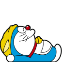
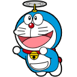
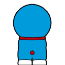

# 🐱 Doraemon Desktop

<p align="center">
  
</p>

<p align="center">
  <em>A Shimeji-style desktop mascot powered by OpenClaw — your AI companion that lives freely on your screen!</em>
</p>

---

## 💙 A Love Letter to Our Childhood

Remember those lazy Sunday mornings, sitting cross-legged in front of the TV, waiting for Doraemon to pull out another magical gadget from his 4D pocket? Remember how we wished — *really, truly wished* — that we had our own Doraemon? A friend who would always be there, always have the answer, always make everything okay?

We grew up. We became developers. We learned that magic is just technology we don't understand yet.

**But we never forgot that wish.**

This project is our way of bringing a piece of that childhood magic back. Every time Doraemon walks across your screen, every time he searches his pocket when you ask a question, every time he falls asleep waiting for you — we hope you feel that same warmth we felt as kids.

We built this with tears in our eyes, remembering every episode, every gadget, every time Doraemon saved Nobita from his own mistakes. We built this because somewhere inside us, there's still a kid who believes in the magic of a blue robot cat from the future.

**Now, Doraemon can live on your desktop. He's powered by AI. He reacts to your work. He keeps you company.**

*He's finally here.*

---

> ⭐ **If this project brings back memories for you too, please give it a star!**  
> 🍴 **Fork it, customize it, make your own childhood dream come true.**  
> 💬 **Share your Doraemon memories in the discussions — we'd love to hear them!**

---

## ✨ Features

- 🚶 **Walks, climbs, falls** — Full physics-based Shimeji behavior
- 🎭 **25+ emotions** — Rich emotional expressions with smooth transitions
- 🧠 **OpenClaw integration** — Reacts to AI events in real-time
- 💬 **Chat interface** — Talk directly with your AI through Doraemon
- 🔄 **Auto-reconnect** — Graceful handling of connection issues
- 🎲 **Sentient behavior** — Random emotions and actions even when offline
- 🖥️ **Cross-platform** — macOS, Windows, Linux

## 🚀 Quick Start

```bash
# Install dependencies
npm install

# Run in development mode
npm run dev

# Build for production
npm run build
```

## ⚙️ Configuration

### Environment Variables

Create a `.env` file or set environment variables:

```bash
# OpenClaw Gateway URL (required for AI features)
OPENCLAW_URL=ws://127.0.0.1:18789
```

### Connecting to OpenClaw

#### Local Deployment

If you're running OpenClaw locally:

```bash
# Default local gateway
OPENCLAW_URL=ws://127.0.0.1:18789
```

#### Cloud Deployment

For cloud-hosted OpenClaw instances:

```bash
# Secure WebSocket for cloud
OPENCLAW_URL=wss://your-openclaw-server.com:18789

# With custom port
OPENCLAW_URL=wss://openclaw.example.com:443/gateway
```

#### Connection Examples

| Deployment | URL |
|------------|-----|
| Local (default) | `ws://127.0.0.1:18789` |
| Local (custom port) | `ws://localhost:8080` |
| Cloud (secure) | `wss://api.openclaw.io:18789` |
| Cloud (behind proxy) | `wss://openclaw.mycompany.com/ws` |

### Running with Environment Variables

```bash
# macOS / Linux
OPENCLAW_URL=wss://my-server.com:18789 npm run dev

# Windows (PowerShell)
$env:OPENCLAW_URL="wss://my-server.com:18789"; npm run dev

# Windows (CMD)
set OPENCLAW_URL=wss://my-server.com:18789 && npm run dev
```

## 🎭 Emotions & Behaviors

### OpenClaw Event Reactions

| Event | Emotion | Animation |
|-------|---------|-----------|
| AI thinking | 🤔 thinking | Searching 4D pocket |
| Response complete | 🎊 success | Ta-da! Gadget pulled |
| Error | 😤 frustrated | Trip and fall |
| Tool running | 💪 working | Using gadget |
| Connection lost | 😢 sad | Disconnected animation |
| Reconnected | 🎉 celebrating | Jump for joy |

### Idle Behavior (Progressive)

| Idle Time | Emotion | Behavior |
|-----------|---------|----------|
| 0-1 min | 😊 neutral | Random emotion flickers |
| 1-3 min | 😌 relaxed | Calm, occasional curiosity |
| 3-5 min | 😑 bored | Fidgeting, more random actions |
| 5-10 min | 😴 sleepy | Yawning, drowsy |
| 10+ min | 💤 sleeping | Deep sleep (wakes on activity) |

### Random "Sentient" Behaviors

Doraemon feels alive even when idle:
- **Looking around** — Curious glances
- **Pocket check** — Randomly searches 4D pocket
- **Stretching** — Occasional stretch
- **Yawning** — When getting sleepy
- **Emotion flickers** — Brief happy, curious, or mischievous moments

## 🔌 Offline Mode

Doraemon works without OpenClaw! When disconnected:

- ✅ All animations and physics work
- ✅ Random emotions and behaviors continue
- ✅ Chat responds with personality messages
- ✅ Auto-reconnects with exponential backoff
- ✅ Shows connection status in UI

Offline chat responses:
- *"I can't reach OpenClaw right now... but I'm still here! 💙"*
- *"My 4D pocket can't connect... OpenClaw might be sleeping! 💤"*
- *"I'm in offline mode! Start OpenClaw and I'll be smarter~ ✨"*

## 🛠️ Development

### Tech Stack

- Electron 28
- Preact + Signals
- Tailwind CSS
- TypeScript
- electron-vite

### Project Structure

```
doraemon/
├── src/
│   ├── main/
│   │   ├── index.ts           # Electron main process
│   │   └── daemon/            # OpenClaw daemon management
│   │       ├── types.ts
│   │       ├── node-checker.ts
│   │       ├── openclaw-checker.ts
│   │       ├── port-checker.ts
│   │       ├── process-manager.ts
│   │       └── instructions.ts
│   ├── preload/index.ts       # IPC bridge
│   └── renderer/
│       ├── core/
│       │   ├── types/         # Branded types, emotion, connection
│       │   ├── constants/     # Timing, gateway, sprite
│       │   └── utils/         # Result type pattern
│       ├── services/          # Gateway, emotion, sprite-loader
│       ├── stores/            # Preact signals stores
│       ├── hooks/             # Custom hooks
│       ├── ui/
│       │   ├── primitives/    # Button, Spinner, Badge, Icon
│       │   ├── components/    # Setup, Mascot components
│       │   └── layouts/
│       ├── styles/
│       ├── app.tsx            # Main mascot app
│       └── setup-app.tsx      # Setup wizard
├── assets/
│   └── dora-sprites/          # All 80 Shimeji sprites
└── package.json
```

### Scripts

```bash
npm run dev      # Development with hot reload
npm run build    # Production build
npm start        # Run production build
```

### Skip Setup Wizard

```bash
# Via flag
npm run dev -- --skip-setup

# Via environment variable
DORAEMON_SKIP_SETUP=1 npm run dev
```

### Building for Distribution

```bash
# Build the app
npm run build

# Package with electron-builder (add to package.json)
npm run package
```

## 🎮 Controls

| Action | How |
|--------|-----|
| Open chat | Click on Doraemon |
| Send message | Type + Enter |
| Special animation | Double-click |
| Move | Drag and drop |
| Menu | Right-click tray icon |

### Tray Menu

- **Show/Hide** — Toggle visibility
- **Reset Position** — Move to default location
- **Quit** — Exit application

## 🐛 Troubleshooting

### Can't connect to OpenClaw

1. Check if OpenClaw Gateway is running
2. Verify the URL in `OPENCLAW_URL`
3. For cloud: ensure WebSocket port is open
4. Check firewall settings

### Doraemon doesn't animate

1. Check console for errors (View → Developer Tools)
2. Verify sprites exist in `assets/dora-sprites/`
3. Try `npm run build` and restart

### Connection keeps dropping

- Check network stability
- For cloud: verify SSL certificate
- Doraemon auto-reconnects with backoff (1s → 30s max)

## 📝 License

MIT

## 🙏 Credits

### Sprite Assets

<p align="center">
  <a href="https://www.deviantart.com/cachomon/art/Doraemon-Shimeji-FREE-505596307">
    
    
    
    
  </a>
</p>

**Doraemon Shimeji sprites by [Cachomon](https://www.deviantart.com/cachomon)**

The beautiful Doraemon sprites used in this project are from the **[Doraemon Shimeji FREE](https://www.deviantart.com/cachomon/art/Doraemon-Shimeji-FREE-505596307)** pack created by **Cachomon** on DeviantArt.

Thank you Cachomon for creating and sharing these wonderful sprites with the community! 💙

> *If you enjoy these sprites, please visit the original DeviantArt page and show some love to the artist!*

### Other Credits

- **Doraemon** © Fujiko F. Fujio / Shogakukan
- **[Shimeji-ee](https://code.google.com/archive/p/shimeji-ee/)** — This project is inspired by the original Shimeji-ee (Shimeji English Enhanced) project. The physics engine, behavior system, and desktop mascot concept are influenced by Shimeji-ee's wonderful work in bringing desktop companions to life.
- **OpenClaw** — [github.com/openclaw/openclaw](https://github.com/openclaw/openclaw)

---

## 💭 Final Words

To Fujiko F. Fujio — thank you for creating Doraemon. You gave millions of children around the world a friend, a dream, and a belief that the future could be wonderful. Your creation taught us about friendship, perseverance, and the magic of imagination.

To everyone who grew up with Doraemon — this one's for us. For the kids we were, and the dreamers we still are.

*Doraemon will always be there when you need him. Now, he's just a `npm install` away.*

---

<p align="center">
  
</p>

<p align="center">
  <strong><em>"No matter how hard things get, Doraemon will always help you."</em></strong><br>
  <em>— Every kid who ever watched Doraemon</em>
</p>

<p align="center">
  <em>"Doraemon, I need a gadget!" — Nobita</em>
</p>

<p align="center">
  <em>"Here you go!" — Doraemon 🐱💙</em>
</p>
